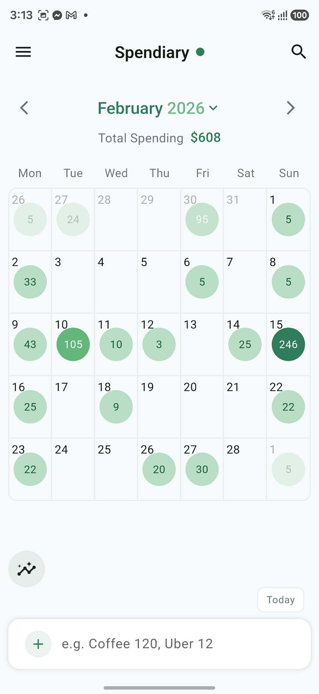
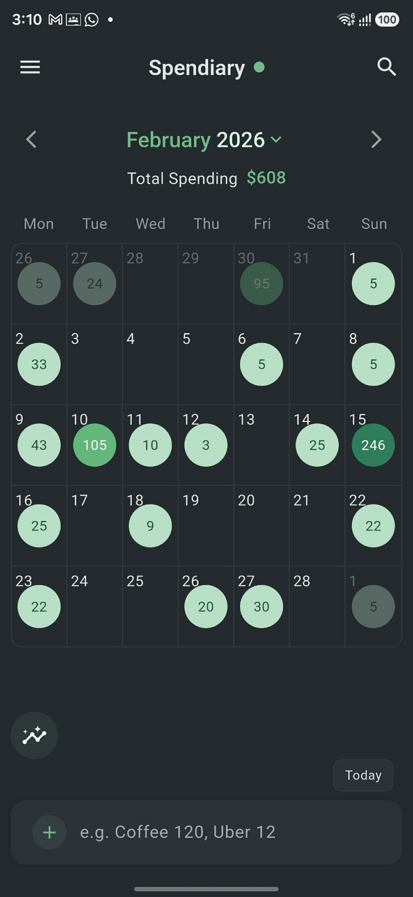
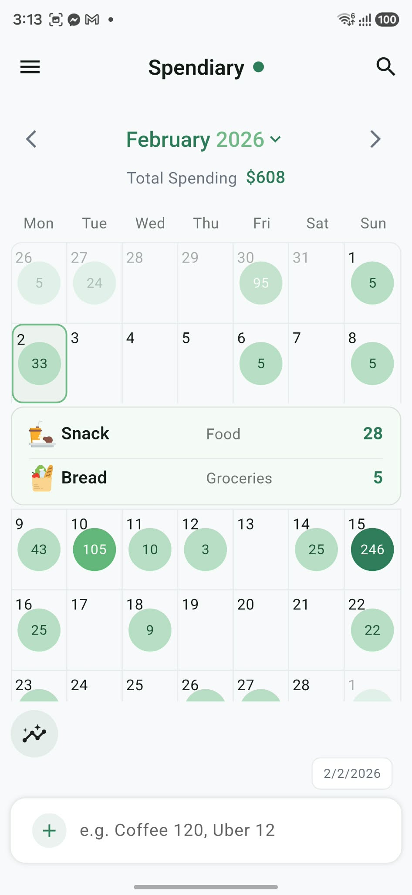
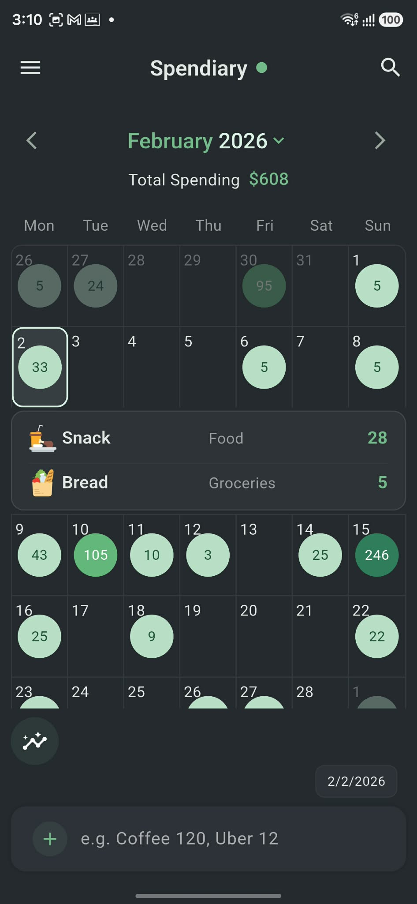
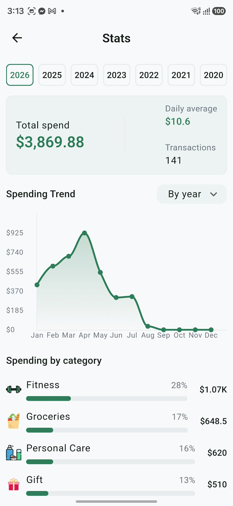
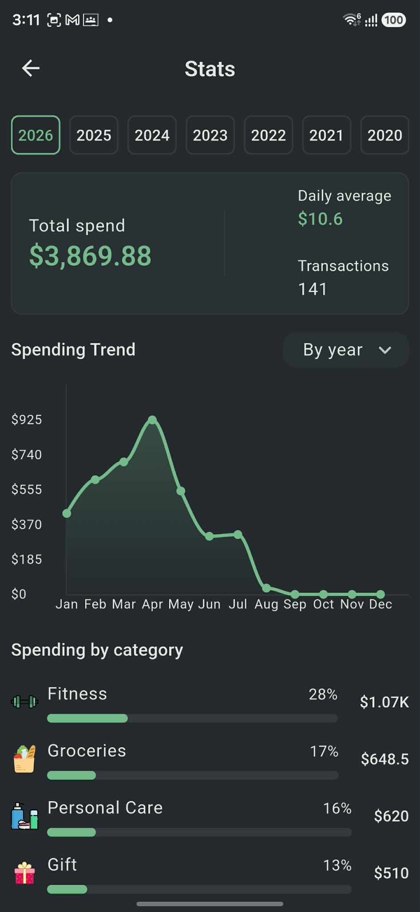
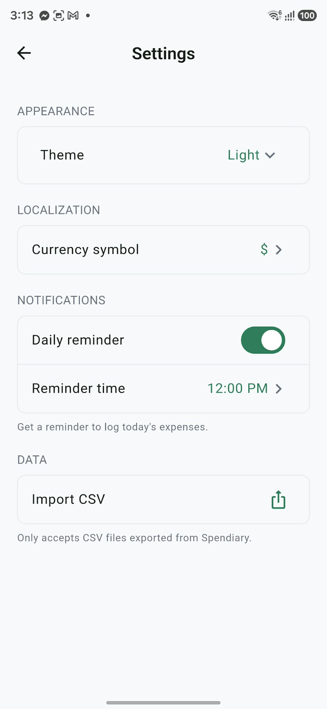
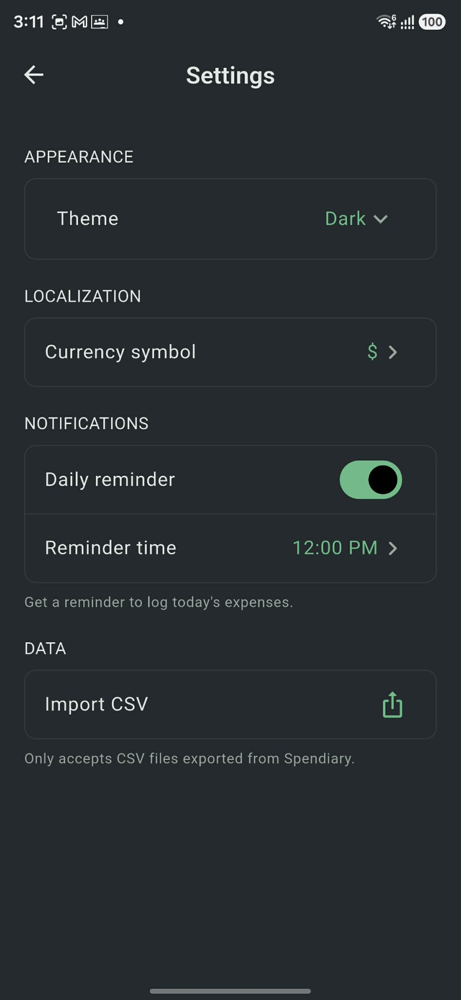

# Spendiary

A minimalist personal finance app built with **Flutter and Dart**, designed for fast expense tracking and a clear visual overview of spending.

## Demo

🎥 **[Watch Demo Video](https://www.youtube.com/shorts/AZ9ZMtqbLWA)**  
📱 **[Download Android APK](https://drive.google.com/file/d/1UgCrMMRNKae5-ktWqpiUhkVNxMw9GPQu/view?usp=drive_link)**  

> Spendiary is currently being prepared for its initial Android release.
> The APK is available for testing on Android devices. If you prefer not to install an APK,
> the demo video provides a quick look at the app in action.

## Screenshots

### Main

The main screen combines the interactive spending calendar with quick expense entry.

<table>
  <tr>
    <th>Light Mode</th>
    <th>Dark Mode</th>
  </tr>
  <tr>
    <td></td>
    <td></td>
  </tr>
</table>

### Expanded Day

View the expenses recorded for an individual day.

<table>
  <tr>
    <th>Light Mode</th>
    <th>Dark Mode</th>
  </tr>
  <tr>
    <td></td>
    <td></td>
  </tr>
</table>

### Statistics

Analyze spending patterns and totals.

<table>
  <tr>
    <th>Light Mode</th>
    <th>Dark Mode</th>
  </tr>
  <tr>
    <td></td>
    <td></td>
  </tr>
</table>

### Settings

Manage application settings and customization.

<table>
  <tr>
    <th>Light Mode</th>
    <th>Dark Mode</th>
  </tr>
  <tr>
    <td></td>
    <td></td>
  </tr>
</table>

## Features

- 📅 **Interactive Spending Calendar**
  - View daily spending totals at a glance
  - Expand individual days to view expenses
  - Navigate between months

- ⚡ **Fast Expense Entry**
  - Quick amount and note input
  - Designed for minimal interaction and fast logging

- 🤖 **Automatic Expense Categorization**
  - Classifies expenses from their descriptions
  - Uses TF-IDF and Logistic Regression

- 📊 **Spending Statistics**
  - Analyze spending patterns and totals

- 🔎 **Expense Search**
  - Search and browse recorded expenses

- 🌙 **Light & Dark Themes**
  - Full support for both light and dark modes

## Tech Stack

- **Flutter**
- **Dart**
- **Riverpod**
- **SQLite**
- **TF-IDF**
- **Logistic Regression**

## Technical Highlights

- Custom calendar-based spending visualization
- Riverpod-based state management
- Reusable Flutter widgets and components
- Machine-learning-based expense categorization
- Mobile-first UI designed for fast interaction
- Light and dark theme support

## Project

Spendiary was built from scratch as a real personal finance product, with a focus on making expense tracking quick enough for everyday use while providing a clear overview of spending.

---

**Built with Flutter & Dart by [Sanad Alawi](https://github.com/SanadAlawi)**
